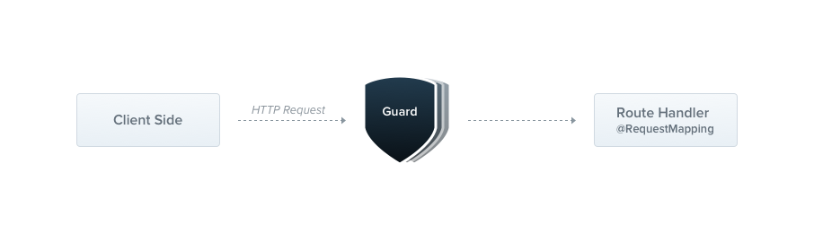

# Estructura de un modulo

- **NestJS**
    - example.model
    - example.module
    - example.service
    - example.service.spec
- **GraphQL**
    - example.dto
    - example.entity
    - example.resolver

## [Module](https://docs.nestjs.com/module)

A module is a class annotated with a @Module() decorator. The @Module() decorator provides metadata that Nest makes use
of to organize the application structure.

## [Controller](https://docs.nestjs.com/controller)

Controllers are responsible for handling incoming requests and returning responses to the client.

## [Guard](https://docs.nestjs.com/guard)

A guard is a class annotated with the @Injectable() decorator, which implements the CanActivate interface.

## [Pipes](https://docs.nestjs.com/pipes)

A pipe is a class annotated with the @Injectable() decorator, which implements the PipeTransform interface.

## [Midleware](https://docs.nestjs.com/midleware)

Middleware is a function which is called before the route handler. Middleware functions have access to the request and
response objects, and the next() middleware function in the application’s request-response cycle.

## [Interceptor](https://docs.nestjs.com/interceptors)

An interceptor is a class annotated with the @Injectable() decorator and implements the NestInterceptor interface.

## [Exception filters](https://docs.nestjs.com/exception-filters)

Nest comes with a built-in exceptions layer which is responsible for processing all unhandled exceptions across an
application. When an exception is not handled by your application code, it is caught by this layer, which then
automatically sends an appropriate user-friendly response.

